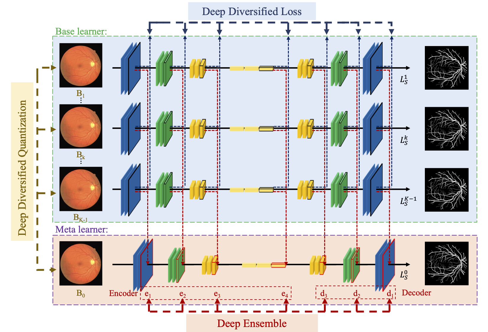

# QDD-Ens: Quantization-based Deep Diversified Ensemble for Biomedical Image Segmentation




**Abstract**:

*Biomedical image segmentation plays a central role in quantitative analysis, clin ical diagnosis, and medical intervention. Recently, fully convolutional networks  (FCNs) have boosted its performance by efficiently exploiting multi-scale contex tual information. Meanwhile, the ensemble method is usually further adopted to enhance performance. However, it only fuses the outputs of individual FCNs and  ignores the internal multi-scale feature interaction among these FCNs. Here, we  argue that current ensemble methods may not fully exploit the potential of the  rich multi-scale feature and ensemble diversity among FCNs. In this paper, we  propose the quantization-based multi-scale ensemble network (QME-Net) by using a meta learner to fuse features at multiple resolution levels from base learners,  with a large ensemble diversity gain from two optimizations. The first adopts  diverse network quantization as a strict constraint to produce a variety of learners owning comparable performance with high diversity. The second is a new loss  function, deep diversity loss, which can enlarge the ensemble diversity among FCNs in a deep supervision way. We conducted comprehensive experiments cross four widely-used FCNs and three public biomedical segmentation datasets, and the  results show that our method can effectively improve the segmentation accuracy.*


## Requirements

The  code requires

- Python 3.6 or higher
- PyTorch 0.4 or higher

and the requirements highlighted in [requirements.txt](./requirements.txt) (for Anaconda)


## Training

To train the CE-Net based QME-Net with default setting in the paper on DRIVE dataset, run this command:

```train
python train.py --backbone CE-Net --dataset DRIVE --alpha 0.005 --epoch 1200 -- epochQ 300 --batchsize 4
```


## Evaluation

To evaluate my model on DRIVE dataset, run this command:

```eval
python eval.py --model-path QME-Net_DRIVE.pth 
```


